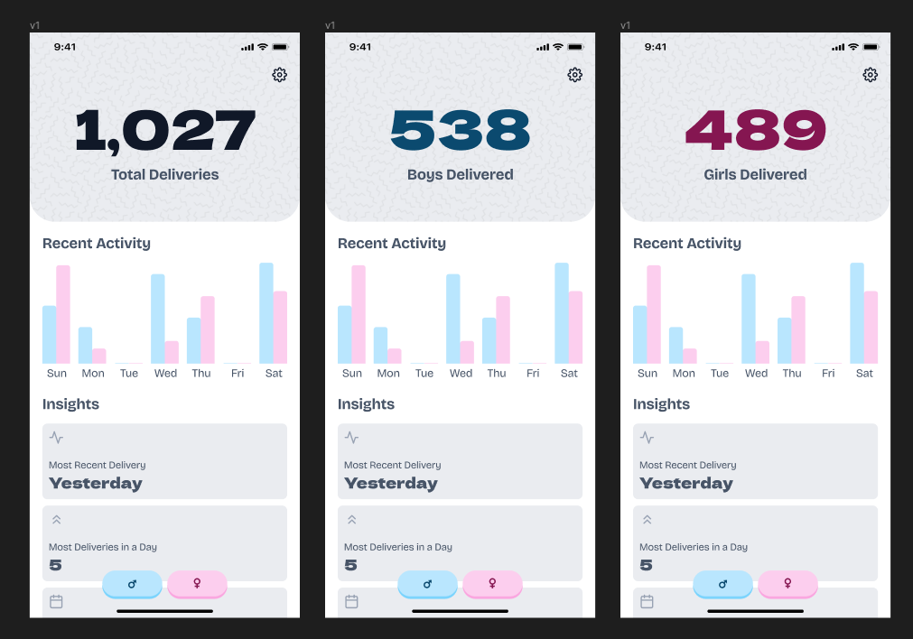

# stork

Newborn delivery counting app, built using [React Native](https://reactnative.dev/)
and powered by [Expo](https://expo.dev/).

## Background

In the fall of 2023, during my girlfriend's nursing preceptorship in the Labor &
Delivery (L&D) unit, I noticed a crucial issue. L&D nurses lacked an accurate
record-keeping system for their work, leaving them unsure about the number of
babies they delivered throughout their careers.

Inspired by "birth counter boards" on platforms like Etsy, and finding no existing
digital solutions, I decided to create a simple mobile app tailored for L&D nurses,
midwives, and healthcare professionals. This GitHub repository is the result of my
efforts to address this unmet need in healthcare.



## Architecture

The app is built local-first, requiring no API calls to external servers/databases.

Application state is persisted with SQLite using the following design/modeling:

```sql
CREATE TABLE IF NOT EXISTS deliveries (id INTEGER PRIMARY KEY, timestamp DATETIME DEFAULT CURRENT_TIMESTAMP, sex INTEGER NOT NULL);
```

| Column        | Type     | Constraints               |
| ------------- | -------- | ------------------------- |
| **id**        | INTEGER  | PRIMARY KEY               |
| **timestamp** | DATETIME | DEFAULT CURRENT_TIMESTAMP |
| **sex**       | INTEGER  | NOT NULL                  |

## Progress / TODOs

- [x] running tally: tracking the total number of deliveries as well their sex
- [x] dynamic insights: incrementing the tally automatically updates insights
- [ ] interactive charts/graphs: wanting to use pan gesture handling similar to
      financing apps like Mint and Robinhood to update tally based on given position on chart
- [ ] settings: update tally background image, export data, etc.
